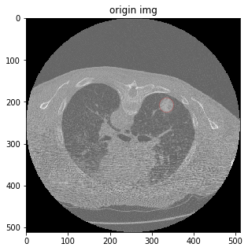
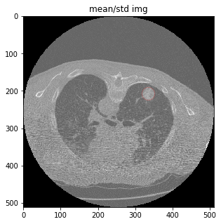
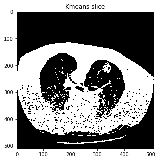
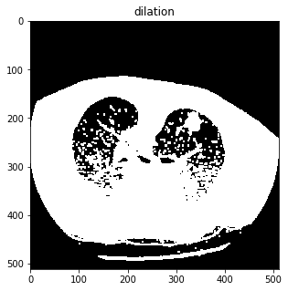
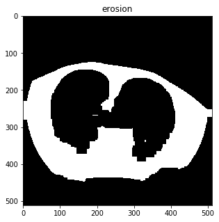
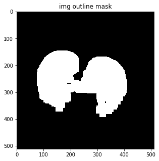
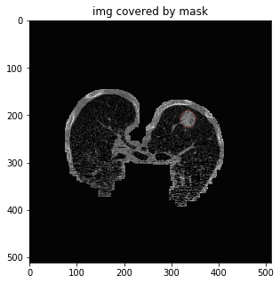
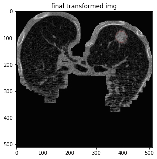
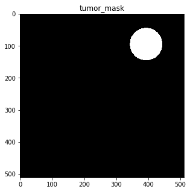

# 天池医疗AI大赛[第一季]：肺部结节智能诊断

[天池医疗AI大赛[第一季]：肺部结节智能诊断](https://tianchi.aliyun.com/competition/information.htm)

# 2D卷积神经网络

> 见Tumor.ipynb

## Feature Engineering



### 坐标变换

```
pos = np.round((pos - origin) / spacing)
diameter = tumor['diameter_mm'] / spacing[0]
```

对图像和tumor diameter进行空间坐标变化

### Normalization

```
mean, std = np.mean(img), np.std(img)
img = (img - mean) / std
```



### 黑白(0/1)转化

```
kmeans = KMeans(n_clusters=2).fit(np.reshape(mask, (np.prod(mask.shape), 1)))
threshold = np.mean(kmeans.cluster_centers_)
mask = np.where(mask>=threshold, 1.0, 0.0)
```

通过Kmeans把image划分为2个cluster，然后找到centroid均值，做划分



### dilation & erosion

```
mask = morphology.dilation(mask, np.ones([4, 4]))
mask = morphology.erosion(mask, np.ones([24, 24]))
```

这里4和24是通过不断尝试找到的合理值。





### Label Region

```
labeled_mask = measure.label(mask, background=1)
regions = measure.regionprops(labeled_mask)
```

得到连续的肺的mask，排除身体周围等其他连续区域mask





### 聚焦

把图像放大到肺部，并保持图像size不变





## U-Net神经网络

定义U-Net神经网络

```
    inputs = Input((1, img_rows, img_cols))
    conv1 = Conv2D(32, (3, 3), activation='relu', padding='same')(inputs)
    #       Conv2D(32, (3, 3), activation="relu", padding="same")

    conv1 = Conv2D(32, (3, 3), activation='relu', padding='same')(conv1)
    pool1 = MaxPooling2D(pool_size=(2, 2))(conv1)

    conv2 = Conv2D(64, (3, 3), activation='relu', padding='same')(pool1)
    conv2 = Conv2D(64, (3, 3), activation='relu', padding='same')(conv2)
    pool2 = MaxPooling2D(pool_size=(2, 2))(conv2)

    conv3 = Conv2D(128, (3, 3), activation='relu', padding='same')(pool2)
    conv3 = Conv2D(128, (3, 3), activation='relu', padding='same')(conv3)
    pool3 = MaxPooling2D(pool_size=(2, 2))(conv3)

    conv4 = Conv2D(256, (3, 3), activation='relu', padding='same')(pool3)
    conv4 = Conv2D(256, (3, 3), activation='relu', padding='same')(conv4)
    pool4 = MaxPooling2D(pool_size=(2, 2))(conv4)

    conv5 = Conv2D(512, (3, 3), activation='relu', padding='same')(pool4)
    conv5 = Conv2D(512, (3, 3), activation='relu', padding='same')(conv5)

    up6 = concatenate([UpSampling2D(size=(2, 2))(conv5), conv4], axis=1)
    conv6 = Conv2D(256, (3, 3), activation='relu', padding='same')(up6)
    conv6 = Conv2D(256, (3, 3), activation='relu', padding='same')(conv6)

    up7 = concatenate([UpSampling2D(size=(2, 2))(conv6), conv3], axis=1)
    conv7 = Conv2D(128, (3, 3), activation='relu', padding='same')(up7)
    conv7 = Conv2D(128, (3, 3), activation='relu', padding='same')(conv7)

    up8 = concatenate([UpSampling2D(size=(2, 2))(conv7), conv2], axis=1)
    conv8 = Conv2D(64, (3, 3), activation='relu', padding='same')(up8)
    conv8 = Conv2D(64, (3, 3), activation='relu', padding='same')(conv8)

    up9 = concatenate([UpSampling2D(size=(2, 2))(conv8), conv1], axis=1)
    conv9 = Conv2D(32, (3, 3), activation='relu', padding='same')(up9)
    conv9 = Conv2D(32, (3, 3), activation='relu', padding='same')(conv9)

    conv10 = Conv2D(1, (1, 1), activation='sigmoid')(conv9)

    model = Model(inputs=inputs, outputs=conv10)

    model.compile(optimizer=Adam(lr=1.0e-5), loss=dice_coef_loss, metrics=[dice_coef])
```

确定lost function为y_truth和y_pred的重叠区域*2，除以2个区域的"面积"和。

```
    y_true_f = K.flatten(y_true)
    y_pred_f = K.flatten(y_pred)
    intersection = K.sum(y_true_f * y_pred_f)
    return -(2. * intersection + smooth) / (K.sum(y_true_f) + K.sum(y_pred_f) + smooth)

```

# 3D卷积神经网络

> 见Tumor-3D.ipynb

类似于2D卷积神经网络，不同的是，我定义X_train的每一个样本为某个病人的某个tumor位置上下32个slice组成的立体空间block（同样需要做Fine Feature Engineering），y_train为这样一个空间，只有以tumor center point为球心，diameter为直径的一个球体。
